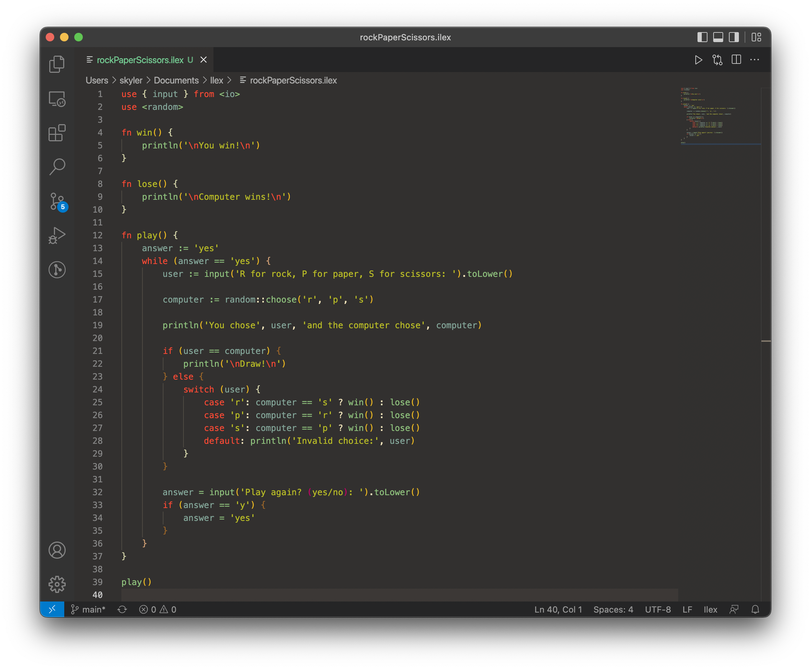

# Ilex

Ilex is a simple easy to use, statically (not yet) typed programming language.

Ilex is a high-level statically (TODO) typed programming language. It has a familiar c++/go/typescript-like syntax with inspiration from other languages such as Ruby and Python.

The main goal of Ilex is to be easy to use and facilitate the development of LIQUID code. What is LIQUID code you might ask? LIQUID stands for Low In Quality Unrivaled In Despair. Ilex strives for adequacy and will settle for nothing less (eventually).

Ilex is based off of Lox from the excellent book [Crafting Interpreters](https://craftinginterpreters.com/).
If you're interested in making something like Ilex I highly recommend giving it a read.

Ilex is a WIP and the language is subject to change.
